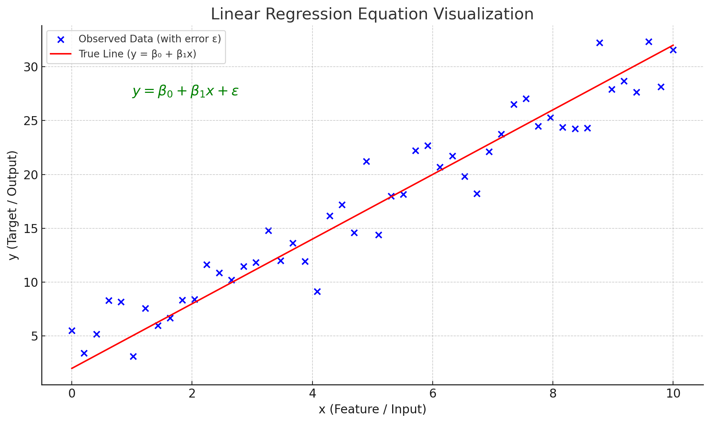

#  📘 Definition of Regression (in Machine Learning)
Regression is a type of supervised learning algorithm in machine learning where the goal is to predict a continuous numerical value based on input features.

## 📌 Simple Definition:
Regression is a method to model and analyze the relationship between one or more independent variables (inputs) and a dependent variable (output), where the output is continuous (not categorical).

# 🧠 Example Use Cases:

| Problem                 | Input Features               | Output (Regression Target) |
| ----------------------- | ---------------------------- | -------------------------- |
| Predict house prices    | Area, Location, Rooms        | Price in dollars           |
| Predict student's score | Hours studied                | Marks (0–100)              |
| Forecast temperature    | Date, Time, Weather patterns | Temperature (°C or °F)     |
| Predict car mileage     | Engine size, Weight          | MPG (Miles per Gallon)     |

# 💡 Mathematical View (Linear Regression)

The most basic and commonly used regression model is **Linear Regression**:

y = β₀ + β₁x + ε

Where:
- y: Target value (output)
- x: Feature (input)
- β₀: Intercept (bias term)
- β₁: Coefficient (slope of the line)
- ε: Error term (random noise)

1. ***Red Line:*** Represents the true relationship between x and y (without noise).
2. ***Blue Dots:*** Show the actual observed data points, which include some random noise 𝜖
3. ***Equation Annotation:*** Helps you visually connect the equation with the graph.
4. This graph is a great way to demonstrate how linear regression fits a line through noisy data to model a relationship between input
x and output
y.

# 📈 What is a Best Fit Line in Linear Regression?
Think of it like this:

If you scatter your data points on a graph and try to draw a single straight line that is as close as possible to all those points, the line you draw is the best fit line.

This line helps you understand the relationship between the input (independent variable) and the output (dependent variable), and it also helps you make predictions.

# ❓ Is the Best Fit Line Always a Straight Line?
No, the "best fit line" is only a straight line in linear regression.

## more info
 | Type of Regression         | Shape of Best Fit Line       |
| -------------------------- | ---------------------------- |
| **Linear Regression**      | Straight line                |
| **Polynomial Regression**  | Curved line (e.g., parabola) |
| **Exponential Regression** | Exponential curve            |
| **Logarithmic Regression** | Logarithmic curve            |

# Types:
- ***a. Simple LR***:
    - There will one input column and one out-put column. eg; In a data set there are 2 columns, cgpa and package. Now you have create a model where you need to find a student with a cgpa of 6, how much package he can score.

- ***b. multiple LR:***
    - There will one input column and one out-put column. eg; In a data set there are many columns like `age`, `gender`, `10th marks`, `12th marks`, `cgpa and package`. Now you have create a model where you need to find a student with age, gender, 10th marks, 12th marks of 6, how much package he can score.

- ***c. polunomial LR***

    - it is also called `closed form solution`
    - it is a mathemitial expression where you can get the result my applying finaite number of steps, variable, formula.

    - there should be no intregation or differentiation involbed.