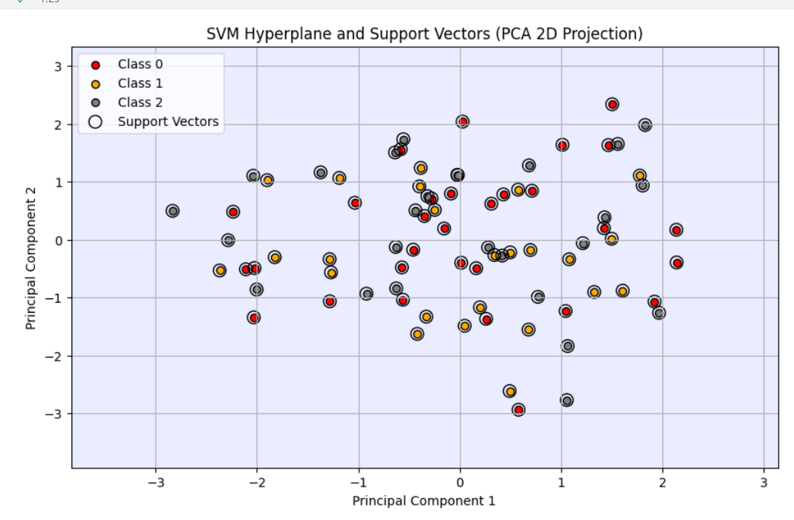

# 📘 Support Vector Machine (SVM) - Detailed Explanation

Support Vector Machine (SVM) is a **supervised learning algorithm** that is widely used for **classification** and, to a lesser extent, **regression** problems.

---

## 🧠 1. What is the Core Idea of SVM?

The main idea of SVM is to find a **hyperplane** that **best separates** the data into classes.



### Colored Dots = Data Points
Each dot is a sample (row in your dataset).

-   🔴 Red = Class 0
-   🟠 Orange = Class 1
-   ⚫ Black = Class 2

These classes correspond to the target labels in your classification task.

### ⭘ White Circles Around Some Dots = Support Vectors
- Support Vectors are the critical data points that lie closest to the decision boundaries (hyperplanes) and influence the SVM's decision.
- They define the "margins" for the hyperplanes. These are essential in determining the separating boundaries.


- A **hyperplane** is a decision boundary that separates data points.
- SVM finds the hyperplane that **maximizes the margin** — the distance between the hyperplane and the **nearest points** from each class.
- The data points that lie on the edge of this margin are called **support vectors**.

---

## 📏 2. Linear SVM - Linearly Separable Data

For a dataset that can be separated by a straight line (or plane), the goal is to:

- Find a **line (2D)** or **plane (3D or higher)** that **maximally separates** the classes.
- The line with the **maximum margin** between the closest points (support vectors) is chosen.

### 🎯 Objective:

Find `w` and `b` such that:
```math
f(x) = w · x + b
```
# Key Terminologies
| Term                | Description                                                                     |
| ------------------- | ------------------------------------------------------------------------------- |
| **Hyperplane**      | The decision boundary that separates classes.                                   |
| **Margin**          | Distance between the hyperplane and nearest data points (support vectors).      |
| **Support Vectors** | Data points closest to the hyperplane that define the margin.                   |
| **Kernel**          | Function that transforms data into higher dimensions for non-linear separation. |


# Advantages of SVM
- Works well in high-dimensional spaces (many features).
- Effective when the margin of separation is clear.
- Memory efficient, as it uses only a subset of training points (support vectors).
- Can be used for non-linear classification using kernel functions.

# Disadvantages of SVM
- Slow training for large datasets.
- Hard to choose the right kernel and parameters (like C, gamma).
- Performance is poor if data is overlapping or noisy.
- Less interpretable compared to other models like decision trees.

# Use Cases of SVM
- Spam detection
- Image recognition
- Handwriting recognition
- Bioinformatics (e.g., cancer detection)

# Summary
- SVM is a powerful and flexible classification algorithm.
- It works well in high-dimensional and complex datasets.
- Choosing the right kernel and parameters is key to performance.
- SVM provides strong theoretical guarantees and often achieves good performance.

# Data Set over-view

| Your Column | Meaning (from Seed Dataset) |
| ----------- | --------------------------- |
| `A`         | Area                        |
| `P`         | Perimeter                   |
| `C`         | Compactness                 |
| `LK`        | Length of Kernel            |
| `WK`        | Width of Kernel             |
| `A_Coef`    | Asymmetry Coefficient       |
| `LKG`       | Length of Kernel Groove     |
| `target`    | Class Label (1, 2, or 3)    |


# What is a Confusion Matrix?
A confusion matrix is a summary of prediction results for a classification problem.
It shows how many predictions were:

|                    | Predicted Class 1 | Predicted Class 2 | Predicted Class 3 |
| ------------------ | ----------------- | ----------------- | ----------------- |
| **Actual Class 1** | True Positives    | False Negatives   | False Negatives   |
| **Actual Class 2** | False Positives   | True Positives    | False Negatives   |
| **Actual Class 3** | False Positives   | False Positives   | True Positives    |


# What the Plot Shows

- Each dot is a data point from your training set.
- The axes are the first two principal components—these are new features created by PCA to capture the most variance in your data.
- Colors represent different classes (0 = red, 1 = orange, 2 = gray).

✅ What PCA Does
- Principal Component Analysis is a dimensionality reduction technique:
- It projects high-dimensional data (like 8 features in your case) into 2D or 3D space.
- This helps you visualize complex datasets.
- It preserves structure, especially class separability, as much as possible.


# Explain
```
svm_model = SVC(kernel='rbf', C=1.0, gamma='scale')
svm_model.fit(X_train_scaled, y_train)
```

This creates an instance of an SVM classifier.

SVC stands for Support Vector Classification, and it's part of sklearn.svm.

Inside the parentheses:
kernel='rbf'

Chooses the Radial Basis Function (RBF) kernel.

RBF is a popular non-linear kernel that maps features into higher-dimensional space to handle complex data.

If your data is not linearly separable, RBF works well.

C=1.0

This is the regularization parameter.

It controls the trade-off between:

achieving a low training error

and maintaining a smooth decision boundary.

Smaller C (e.g., 0.1): more regularization, allowing some misclassifications to improve generalization.

Larger C (e.g., 100): less regularization, trying to fit the training data as best as possible, possibly overfitting.

gamma='scale'

Controls how far the influence of a single training example reaches.

